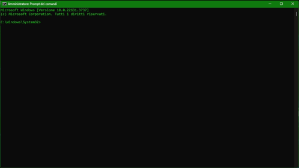

# 

# 🛠️ CLI Task Runner

**Version:** 1.0

---

## 📦 About

`cli-task-runner` is a custom-built Node.js CLI tool designed to run development tasks.  
In **v1.0**, it focuses on **linting JavaScript files** across a project or directory using ESLint.  
It supports both **parallel** and **sequential** linting modes for improved flexibility and performance.

---

## 🚀 Features

- 🔍 Linting support for `.js` files
- ⚡ Parallel and sequential execution modes
- 📂 Recursively scans directories
- 🧾 Error and warning reporting via ESLint
- 📄 Clear logs with icons and timestamps

---

## 📁 Supported Commands

> Currently only `lint` is supported.

### `lint <directory> [--mode=parallel|sequential] [--config=custome-eslint-file](optional)`

**Example:**

```bash
node index.js lint project-path --mode=parallel
```

## 📌 Future Improvements (Coming Soon)

- --fix flag for auto-fixing

- .ts, .jsx, .tsx support

- Configurable output to log file

- Multi-command support (test, build, etc.)

## 🧑‍💻 Author

Developed with ❤️ by <span style="color: skyblue;">Vishal Kumar</span>
